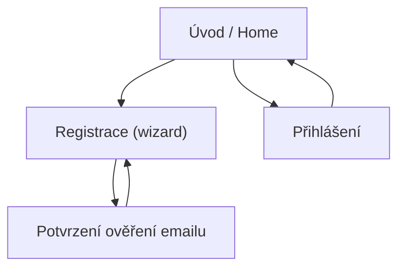

## 1. Product Overview
Registrace ve stylu Google: vícekrokový wizard s plynulou animací, s ověřením emailu hned po 1. kroku.
Cíl: maximální konverze a důvěryhodnost platformy (jasné souhlasy, bezpečnostní signály, transparentnost).

## 2. Core Features

### 2.1 User Roles
| Role | Registration Method | Core Permissions |
|------|---------------------|------------------|
| Návštěvník | Bez registrace | Může otevřít registraci/přihlášení |
| Registrovaný uživatel | Wizard (email + heslo) + ověření emailu | Může se přihlásit a používat aplikaci |

### 2.2 Feature Module
1. **Úvod / Home**: důvěryhodnost (benefity, bezpečnost), CTA na registraci/přihlášení.
2. **Registrace (wizard)**: krokové zadání údajů, animace, souhlasy, ověření emailu po 1. kroku.
3. **Přihlášení**: přihlášení existujícího uživatele.
4. **Potvrzení ověření emailu**: návrat z ověřovacího odkazu a pokračování ve wizardu.

### 2.3 Page Details
| Page Name | Module Name | Feature description |
|-----------|-------------|---------------------|
| Úvod / Home | Důvěryhodnost & CTA | Zobrazit krátké benefity, bezpečnostní tvrzení, odkazy na Podmínky a Zásady soukromí; spustit registraci/přihlášení. |
| Registrace (wizard) | Krok 1 – Účet | Zadávat email a heslo; validovat email; zobrazit indikátor síly hesla a minimální požadavky; vyžadovat souhlas s Podmínkami a Zásadami soukromí; odeslat registrační požadavek a vyvolat ověřovací email. |
| Registrace (wizard) | Krok 2 – Ověření emailu | Zobrazit „Zkontroluj schránku“ se stavem; umožnit znovu odeslat ověření; zablokovat pokračování, dokud není email ověřen; po návratu z odkazu pokračovat na další krok automaticky. |
| Registrace (wizard) | Krok 3 – Telefon & souhlasy | Zadávat telefon (povinné) s předvolbou; validovat formát; vyžadovat souhlas s kontaktem (SMS/telefon) a volitelný marketing souhlas (odděleně); uložit souhlasy s časem a verzí textu. |
| Registrace (wizard) | Krok 4 – Dokončení | Potvrdit vytvoření profilu; zobrazit shrnutí (email, telefon, souhlasy) a tlačítko „Pokračovat do aplikace“. |
| Přihlášení | Přihlášení | Přihlásit uživatele pomocí emailu + hesla; nabídnout reset hesla; odkázat na registraci. |
| Potvrzení ověření emailu | Návrat z emailu | Zpracovat návrat z ověřovacího odkazu; potvrdit úspěch/neúspěch; přesměrovat zpět do registrace na Krok 3. |

## 3. Core Process
### Uživatelský tok (registrace)
1) Na Home klikneš „Vytvořit účet“.
2) Krok 1: zadáš email + heslo a odsouhlasíš Podmínky a Zásady soukromí.
3) Systém odešle ověřovací email a přepne tě na Krok 2 (čekání na ověření).
4) Klikneš na odkaz v emailu → vrátíš se do aplikace (Potvrzení ověření emailu) → automaticky pokračuješ na Krok 3.
5) Krok 3: doplníš telefon a souhlasy pro kontakt (a případně marketing).
6) Krok 4: dokončíš a přejdeš do aplikace.

### Navigační flow (Mermaid)
