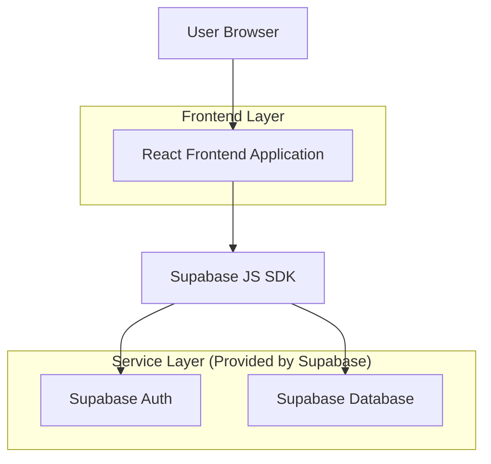
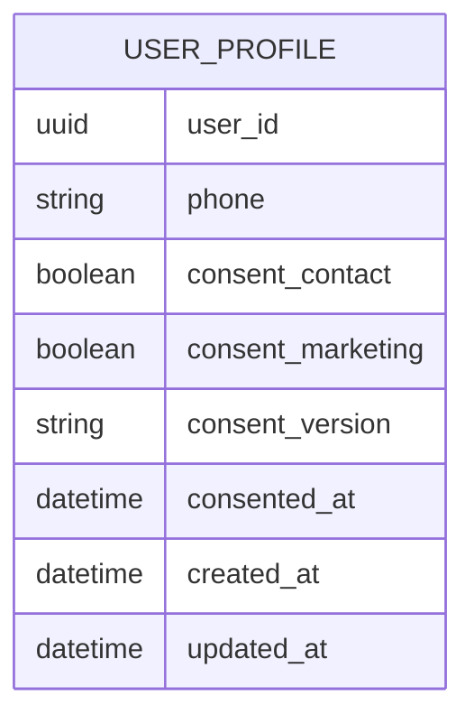

## 1.Architecture design


## 2.Technology Description
- Frontend: React@18 + vite + tailwindcss@3 + framer-motion (animace wizardu)
- Backend: None
- BaaS: Supabase (Auth + Postgres)

## 3.Route definitions
| Route | Purpose |
|-------|---------|
| / | Úvodní stránka s CTA na registraci/přihlášení |
| /register | Registrace – vícekrokový wizard (Krok 1–4) |
| /login | Přihlášení |
| /auth/callback | Návrat z ověřovacího odkazu (potvrzení a redirect do /register) |

## 6.Data model(if applicable)

### 6.1 Data model definition


### 6.2 Data Definition Language
User Profile Table (user_profiles)
```
-- create table
CREATE TABLE user_profiles (
  user_id UUID PRIMARY KEY,
  phone VARCHAR(32) NOT NULL,
  consent_contact BOOLEAN NOT NULL,
  consent_marketing BOOLEAN NOT NULL DEFAULT FALSE,
  consent_version VARCHAR(32) NOT NULL,
  consented_at TIMESTAMP WITH TIME ZONE NOT NULL DEFAULT NOW(),
  created_at TIMESTAMP WITH TIME ZONE NOT NULL DEFAULT NOW(),
  updated_at TIMESTAMP WITH TIME ZONE NOT NULL DEFAULT NOW()
);

-- (doporučení) index na phone, pokud se bude vyhledávat
CREATE INDEX idx_user_profiles_phone ON user_profiles(phone);
