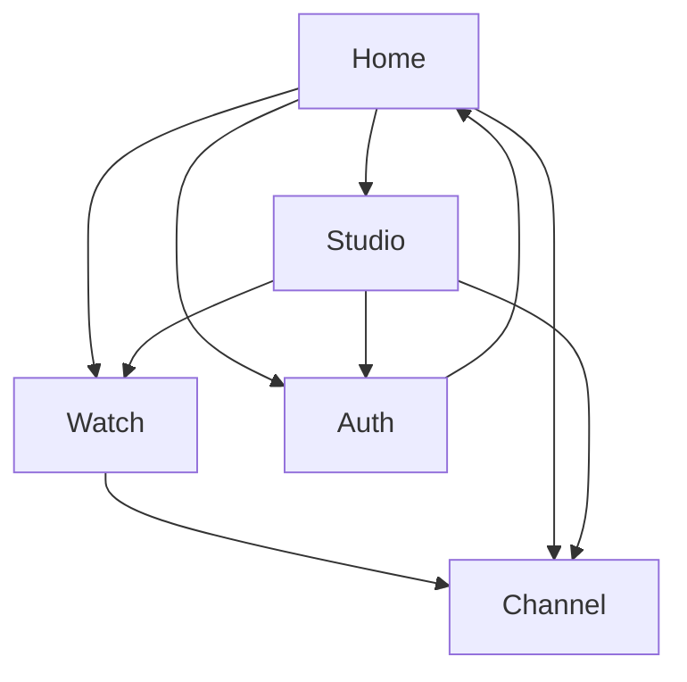

## 1. Product Overview
3Play is a production-ready video platform for watching and publishing videos, with creator tools built in.
It supports public discovery, channel identities, secure uploads, and a consistent brand + UI system across all experiences.

## 2. Core Features

### 2.1 User Roles
| Role | Registration Method | Core Permissions |
|------|---------------------|------------------|
| Viewer (Anon/Auth) | No account needed; optional email/social sign-in | Browse Home, watch videos, view channels |
| Creator (Authenticated) | Supabase Auth sign-in | Upload/manage videos in Studio; manage Channel presence |

### 2.2 Feature Module
Our 3Play requirements consist of the following main pages:
1. **Home**: branding header, navigation, video discovery feed, search entry.
2. **Watch**: video playback, video metadata, channel entry, next/up-next list.
3. **Channel**: channel identity, channel video list, channel about.
4. **Studio**: upload flow, video library management, video details editing, publish controls.
5. **Auth**: sign in/sign up, password reset, session handling/redirect.

### 2.3 Page Details
| Page Name | Module Name | Feature description |
|-----------|-------------|---------------------|
| All Pages (Global) | Branding & Logo System | Apply consistent logo lockups (icon + wordmark), clearspace rules, minimum sizes, and approved colorways across header, auth, and metadata. |
| All Pages (Global) | Design System | Define tokens (color, type, spacing, radius, elevation), component set (buttons, inputs, cards, nav), and interaction states (hover/focus/disabled/loading). |
| All Pages (Global) | Accessibility & Quality Bar | Meet keyboard navigation, focus rings, contrast targets, and error messaging; ensure core flows work without layout shifts. |
| Home | Global Navigation | Navigate to Home, Auth, Channel, Studio (if signed in); show avatar menu when authenticated. |
| Home | Discovery Feed | List videos with thumbnail, title, channel name, views/time; allow basic sorting (e.g., Latest/Popular) if configured. |
| Home | Search Entry | Enter a query and show matching videos/channels inline or via feed refresh. |
| Watch | Player | Play video with standard controls; handle loading/error and fallback when video is unavailable. |
| Watch | Video Details | Display title, channel link, publish date, description (collapsed/expand). |
| Watch | Up Next | Show a minimal related/next list to continue watching. |
| Channel | Channel Header | Display avatar, name/handle, banner, and short description/about. |
| Channel | Video Grid/List | List channel’s published videos; allow basic sort (Latest/Popular) if available. |
| Studio | Access Gate | Require authentication; redirect to Auth and return to Studio after login. |
| Studio | Upload & Processing State | Upload video + thumbnail; show progress; track processing/publish readiness. |
| Studio | Video Library | List creator’s videos with status (Draft/Published/Unlisted), quick actions (edit, publish/unpublish). |
| Studio | Video Editor | Edit title/description/visibility; set thumbnail; save changes. |
| Auth | Sign In / Sign Up | Authenticate via Supabase Auth; validate inputs; show actionable errors. |
| Auth | Password Reset | Send reset email and allow setting a new password. |
| Auth | Session & Redirect | Maintain session; redirect back to intended page (e.g., Studio). |

## 3. Core Process
**Viewer Flow (Anon or Signed-in):** You land on Home, browse the feed or search, open a video on Watch, and optionally navigate to the channel to explore more videos.

**Creator Flow (Authenticated):** You sign in, enter Studio, upload a video (and thumbnail), add metadata, and publish. The video then becomes visible on Home/Channel and playable on Watch.

