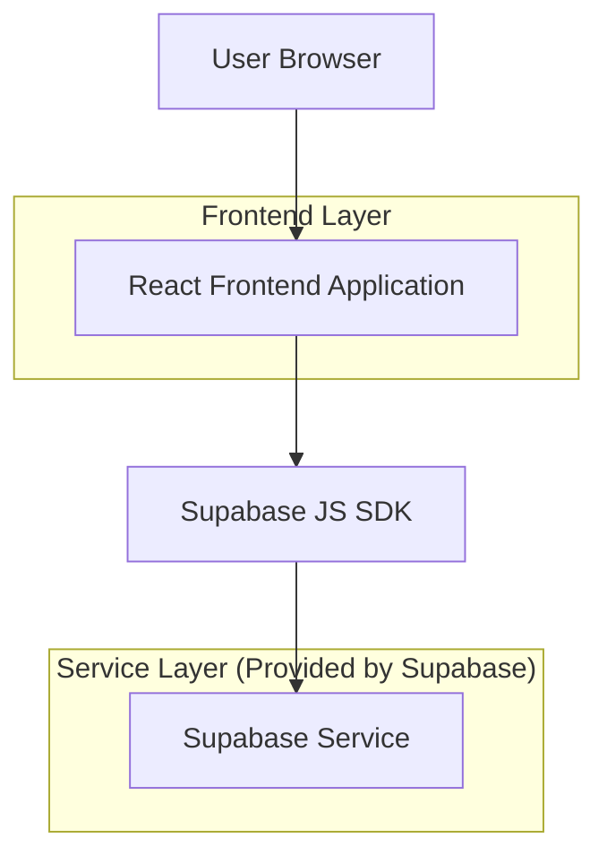
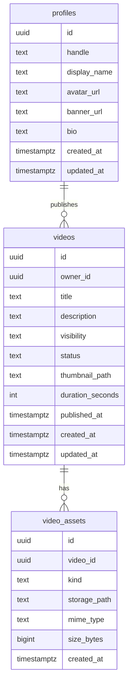

## 1.Architecture design


## 2.Technology Description
- Frontend: React@18 + TypeScript + vite + tailwindcss@3
- Backend: Supabase (Auth + PostgreSQL + Storage)

## 3.Route definitions
| Route | Purpose |
|-------|---------|
| / | Home discovery feed + search entry |
| /watch/:videoId | Watch video playback + details + up-next |
| /channel/:channelIdOrHandle | Channel identity + published videos |
| /studio | Creator upload + manage videos (auth required) |
| /auth | Sign in/sign up/reset + redirects |

## 6.Data model(if applicable)

### 6.1 Data model definition


### 6.2 Data Definition Language
Profiles / Channels (profiles)
```sql
CREATE TABLE profiles (
  id UUID PRIMARY KEY,
  handle TEXT UNIQUE NOT NULL,
  display_name TEXT NOT NULL,
  avatar_url TEXT,
  banner_url TEXT,
  bio TEXT,
  created_at TIMESTAMPTZ DEFAULT NOW(),
  updated_at TIMESTAMPTZ DEFAULT NOW()
);

-- Baseline grants (RLS should still restrict writes)
GRANT SELECT ON profiles TO anon;
GRANT ALL PRIVILEGES ON profiles TO authenticated;
```

Videos (videos)
```sql
CREATE TABLE videos (
  id UUID PRIMARY KEY DEFAULT gen_random_uuid(),
  owner_id UUID NOT NULL, -- logical FK -> profiles.id
  title TEXT NOT NULL,
  description TEXT,
  visibility TEXT NOT NULL DEFAULT 'draft' CHECK (visibility IN ('draft','unlisted','published')),
  status TEXT NOT NULL DEFAULT 'ready' CHECK (status IN ('uploading','processing','ready','failed')),
  thumbnail_path TEXT,
  duration_seconds INT,
  published_at TIMESTAMPTZ,
  created_at TIMESTAMPTZ DEFAULT NOW(),
  updated_at TIMESTAMPTZ DEFAULT NOW()
);

CREATE INDEX idx_videos_owner_id ON videos(owner_id);
CREATE INDEX idx_videos_visibility_published_at ON videos(visibility, published_at DESC);

GRANT SELECT ON videos TO anon;
GRANT ALL PRIVILEGES ON videos TO authenticated;
```

Video Assets (video_assets)
```sql
CREATE TABLE video_assets (
  id UUID PRIMARY KEY DEFAULT gen_random_uuid(),
  video_id UUID NOT NULL, -- logical FK -> videos.id
  kind TEXT NOT NULL CHECK (kind IN ('source','thumbnail')),
  storage_path TEXT NOT NULL,
  mime_type TEXT,
  size_bytes BIGINT,
  created_at TIMESTAMPTZ DEFAULT NOW()
);

CREATE INDEX idx_video_assets_video_id ON video_assets(video_id);

GRANT SELECT ON video_assets TO anon;
GRANT ALL PRIVILEGES ON video_assets TO authenticated;
```

Storage buckets (recommended)
```text
- bucket: videos (private)   -> source uploads; access via signed URLs
- bucket: thumbs (public)    -> thumbnails (or private + signed URLs)
```

RLS policy intent (high-level)
```text
- Public read: allow anon/auth SELECT for videos where visibility='published' AND status='ready'
- Owner write: allow authenticated users to INSERT/UPDATE/DELETE their own videos/assets (owner_id = auth.uid())
- Studio read: owners can read all their own (including drafts)
```